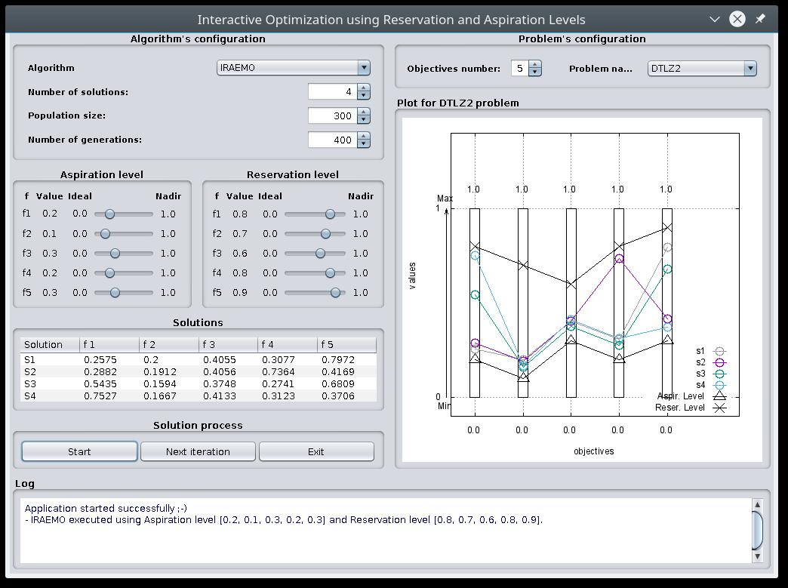

# IRA-EMO
IRA-EMO is an interactive method using reservation and aspiration levels for evolutionary multiobjective optimization. We offer here IRA-EMO as a Java application to solve multiobjective optimization problems in an interactive way using reservation and aspiration levels. Algorithm and implementations details are described in [1] (see footnote).

IRA-EMO has been developed in Java using the NetBeans (https://netbeans.org/) Integrated Development Environment (IDE). It also uses jMetal 4 (http://jmetal.sourceforge.net/), a Java-based framework for multiobjective optimization, and Gnuplot (http://www.gnuplot.info/) to plot Pareto fronts. We include test problems from the ZDT, DTLZ, and WFG families, respectively, for which the number of objectives can vary between two and six. We also include a three-objective real-world optimization problem for the efficiency improvement of the auxiliary services of power plants. Please, note that this real-world problem only works on Windows system and some required files should be in C:\ (contact me if you need help).

Next figure shows the Graphical User Interface (GUI) and the usage of IRA-EMO to solve the DTLZ2 test problem with five objective functions.

Next, we explain each section of the GUI:

- Algorithm's Configuration. There are three parameters to configure: (a) the number of solutions the Decision Maker (DM) would like to compare at the current iteration, (b) the population size, and (c) the number of generations.

- Problem's Configuration. The multiobjective optimization problem to solve.

- Aspiration Level. Approximations of the ideal (best) and the nadir (worst) values are provided to the DM in order to let her/him know the ranges of the objective functions. By clicking on each slider and moving it, the DM can set the aspiration level for each objective.

- Reservation Level. Approximations of the ideal (best) and the nadir (worst) values are provided to the DM in order to let her/him know the ranges of the objective functions. By clicking on each slider and moving it, the DM can set the reservation level for each objective.

- Solution Process. To generate the number of selected solutions, the DM must click the 'Start' button. If the DM decides to take a new iteration by changing some preference information (the aspiration and-or reservation levels and/or the number of solutions to be generated), (s)he must click the 'Next Iteration' button to generate new solutions.

- Solutions. It shows the objective values of the solutions obtained for the current reference levels chosen by the DM.

- Plot for the Problem. It shows the objective vectors of the solutions found and the aspiration and reservation levels. It allows the comparison among different solutions. For biobjective optimization problems, they are plotted in R^2. For multiobjective optimization problems with three or more objective functions, we use a value path representation to shown the solutions obtained and the reference levels. We plot each solution by lines that go across different columns which represent the objective function values they reach. The lower and upper ends of each column represent the total values range of each objective function, that is, its ideal and nadir values, respectively.

- Log. This box shows if there has been any error during the execution.

[1] R. Saborido, A. B. Ruiz, M. Luque, and K. Miettinen, "IRA-EMO: Interactive Method using Reservation and Aspiration Levels for Evolutionary Multiobjective Optimization" in Evolutionary Multi-Criterion Optimization: 10th International Conference, EMO 2019, East Lansing, Michigan, USA, March 10-13, 2019.
